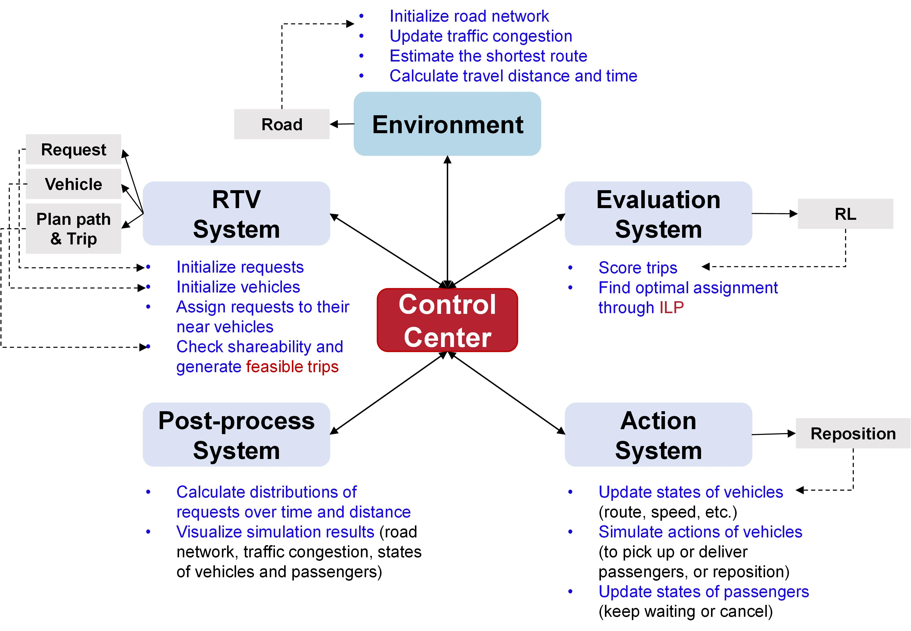

# Ride-sharing-Simulator
A high-capacity ride-sharing simulator calibrated by real request datasets and road networks

<div align="center">
    <br>
    Simulator Architecture
</div>

## Updating...
>>>>>>> feaa40df93a9524c4b3ea13184ca61bd998af4ec
- [x] Implement dispatching and repositioning algorithms of ride-sharing and ride-sourcing
- [x] Add traffic flow models to measure traffic congestion, speed, and carbon emissions
- [x] Implement 2D visualization
- [ ] Provide implementation for Reinforcement Learning algorithms
- [ ] Provide implementation for car-following models
- [ ] Provide implementation for highly realistic 3D visualization


## Setup
1. Install dependencies and libraries
``` bash
pip install -r requirements.txt
```
2. Download [Road Network](https://drive.google.com/file/d/1plVhAfyD0ZtiFEfIHL8HYrPuLczdtvH0/view?usp=share_link) into #Data# filefold


https://youtu.be/upBATpfreoI
